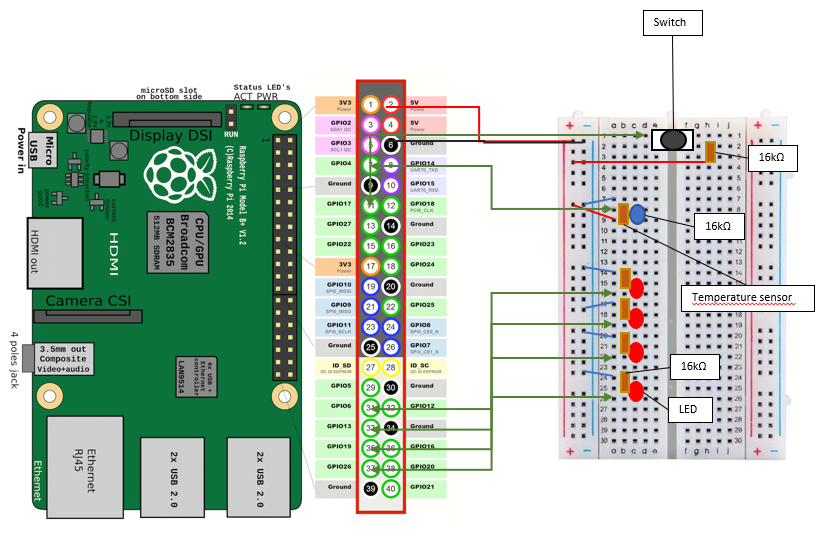

In this project i build a prototype for an alarm system with a raspberry pi.
A text message will be send to a phone, if a certain temperature is reached.
Sensor used:Dallas 18820 3 Pin digital temperature sensor.
Twilio is used to send a text message over the internet to a cell phone
